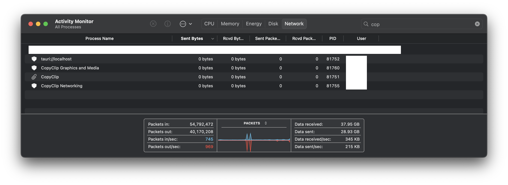
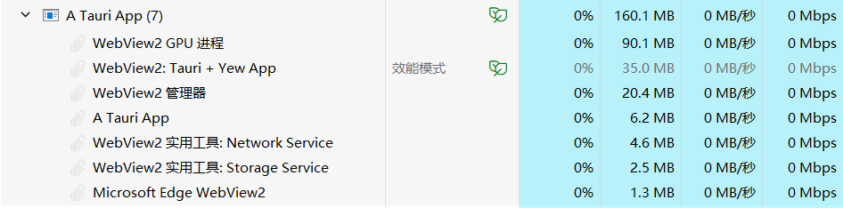

# Copy Clip

A cross-platform and feature-rich app used to manage your clipboard history.

## Disclaimer

### Issues and Bugs

This app is still under development,
and have some known issues and known bugs.

### Privacy

This app only store your clipboard history locally,
and will not send any data to any server.

This is an open source project,
you can check the source code to make sure that we are not doing anything bad.

Or, if you are not familiar with rust,
you can use [WireShark](https://www.wireshark.org/)
or any other packet capture tools to monitor the network traffic of the app.

Or, on MacOS, you can use the system `Activity Monitor`
to monitor the network traffic of the app.


Or, on Windows, you can use the system `Task Manager`
to monitor the network traffic of the app.


## Feedbacks

If you have any feedbacks, 
including requests for new features, reports for bugs, and so on,
please open an [issue](https://github.com/Alex222222222222/CopyClip/issues).

We will try our best to solve the problem.

## Configuration

This is some explanation for configurations in the app.

| name | default value | description |
| ---- | ------------- | ----------- |
| clips per page | 20 | This define how much clips to show in one page in the tray, the maximum value is 50. As if the value is too big, the system tray menu will overflow. |
| max clip length | 50 | when a clip is too long, we cut it to under max-clip-length to fit it into the tray |
| log level filter | info | the log level of the app. `trace`, `info`, `debug`, `warn`, `error`, `off` from most detailed to less |
| dark mode | off | switch the dark mode on and off |
| Enable Auto Delete Duplications | false | if this is true, when a clip is copied, if it is already in the history, the history clip will be deleted |
| Pinned Clips Add | None | Some text to be pinned |
| Pinned Clips Remove | None | The text of the pinned clip that you want to remove |

More configurations is on the way.

## Install

The app supports MacOS, Windows and Ubuntu.
For other Linux distributions, you can [build](#build) the app from source.

Pre-built binaries can be found in [releases](https://github.com/Alex222222222222/CopyClip/releases).

### MacOS

As `sqlite3` is already installed by the system,
there is no need to install any dependency.

Just copy the app to the application folder.

### Linux

`xcb`dependency is needed, to monitor the clipboard.

Use `dpkg` to install the `deb` bundle.

## Known Issues

### MacOS Security Policy

The Mac aarch64 build may have a problem with the macOS security policy,
apple need developer to buy a 99$ per year development program to
let developer to be treated as trusted developer.

You may need to manually run the following command

```bash
sudo spctl --master-disable
sudo xattr -r -d com.apple.quarantine {{the location of your app}}
```

If the problem has not been solved, use the x64 build.

### Other Issues

If you have any other issues, please open an issue with the log file attached,
and information about your system.

Also, please switch the log mod to `trace` to get the most detailed log.

The log file is located at `~/Library/Logs/org.eu.huazifan.copyclip/log`on MacOS.

## Build

### Download the source code

```bash
git clone https://github.com/Alex222222222222/CopyClip.git
cd CopyClip
```

### Prerequisites

You need to have the following installed:

- Rust
- Node.js
- npm
- wasm32-unknown-unknown
- tauri-cli
- trunk
- wasm-opt
- tailwindcss

To install `rust`,
please refer to [rustup](https://www.rust-lang.org/tools/install).

To install `Node.js` and `npm`,
please refer to [Get Node.js](https://nodejs.org/en/download).

Other dependencies can be installed by the following command:

```bash
# wasm32-unknown-unknown
rustup target add wasm32-unknown-unknown

# Install Dependencies
cargo install tauri-cli trunk wasm-opt

# Install npm
npm install
```

For MacOS, install `XCode` and `XCode Command Line Tools`:

```bash
# This will install XCode Command Line Tools
# For XCode, please install it from App Store
xcode-select --install
```

For linux, you need to install extra dependency: - `libxcb*`

```bash
sudo apt-get update
sudo apt install libdbus-1-dev libwebkit2gtk-4.0-dev build-essential \
    curl wget libssl-dev libgtk-3-dev libayatana-appindicator3-dev \
    librsvg2-dev xcb libxcb-randr0-dev libxcb-xtest0-dev libxcb-xinerama0-dev \
    libxcb-shape0-dev libxcb-xkb-dev libxcb-xfixes0-dev
```

If you are using `NixOS`,
you can use the following command in the current dir to install all the dependencies:

```bash
nix develop
```

### Build The App

```bash
cargo tauri build
```

While building, there are some known issues on MacOS:
- Failed to run custom build command for `mac-notification-sys v0.6.1`.
  - This is a known issue, which sometimes caused by use of `nix` to manage dependencies.
  - Myself currently also suffer from this issue, and still looking for a solution.
  - For any progress, please refer to [this issue](https://github.com/Alex222222222222/CopyClip/issues/88).
- Other issues related to `cc` or `ld`, try the following:
  - `rm -rf ./target` and try rebuild again.
  - `sudo rm -rf /Library/Developer/CommandLineTools` and install `XCode Command Line Tools` again, then try rebuild again.

### Run

To automatically rebuild the `TailwindCSS` when the source code changes,
we need to run the following command in another terminal:

```bash
npx tailwindcss -w
```

Then, run the following command to start the app:

```bash
cargo tauri dev
```

## Contributing

Check out [CODE_OF_CONDUCT.md](./CODE_OF_CONDUCT.md) for more information.

## TODO

- [x] Search Page
- [x] Configuration Page
- [ ] Explanation for configurations
- [ ] i18n support
  - [ ] Chinese
- [ ] Sign the app for MacOS build
- [ ] Change the icon of the app so it can be seen in the white background
- [x] Export the history to a file
  - [ ] import the history

## Contributors

<!-- readme: contributors -start -->
<table>
	<tbody>
		<tr>
            <td align="center">
                <a href="https://github.com/Alex222222222222">
                    
                    <br />
                    <sub><b>Zifan Hua</b></sub>
                </a>
            </td>
            <td align="center">
                <a href="https://github.com/ChloeWKY">
                    
                    <br />
                    <sub><b>Chloe</b></sub>
                </a>
            </td>
            <td align="center">
                <a href="https://github.com/LingkKang">
                    
                    <br />
                    <sub><b>Lingkang</b></sub>
                </a>
            </td>
		</tr>
	<tbody>
</table>
<!-- readme: contributors -end -->